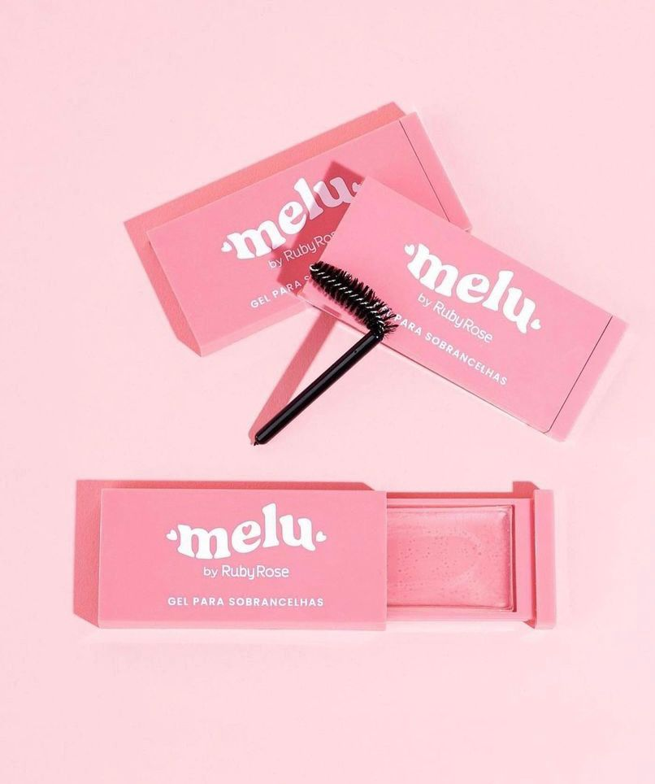
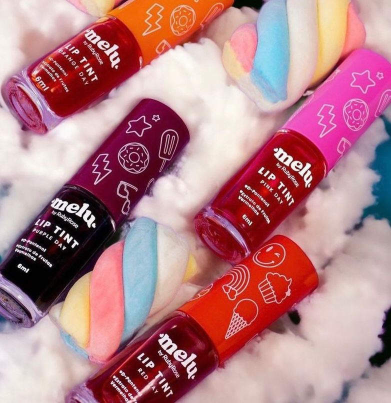

<!DOCTYPE html>
<html>

<head>
    <meta charset="utf-8">
    <meta name="viewport" content="width=device-width, initial-scale=1">
    <title>Make da Crise</title>
    <link rel="stylesheet" href="https://cdn.jsdelivr.net/npm/bulma@0.9.4/css/bulma.min.css">
    <link rel="stylesheet" href="style.css">

    
    <link rel="stylesheet" href="https://cdnjs.cloudflare.com/ajax/libs/font-awesome/6.4.0/css/all.min.css">
</head>

<body>

    <nav class="navbar" role="navigation" aria-label="main navigation">
        

            

            <a role="button" class="navbar-burger" aria-label="menu" aria-expanded="false"
                data-target="navbarBasicExample">
                
                
                
            </a>
        

        <section class="section">
            

              <h1 class="title">
                Olá
              </h1>
              

                Seja bem vindo a <strong>Make da Crise!</strong>
              

            

        

    </nav>

  

    <section class="section primeiro-bloco">
        

            

                

                    <figure class="image is-square">
                        
                    </figure>
                

                

                    

                      

                        
                      

                    

                

            

        

    </section>

    <section class="section">
        

            

                

                    

                        <figure class="image is-4by3">
                            
                        </figure>
                    

                

            

            

                

                    

                        <figure class="image is-4by3">
                            
                                
                        </figure>
                    

                

            

            

                

                    

                        <figure class="image is-4by3">
                            
                        </figure>
                    

                

            

            

                

                    

                        <figure class="image is-4by3">
                            
                        </figure>
                    

                

            

        

    </section>
    
    <section class="section segundo-bloco">
        
        

            
            

                

                    

                        Quem somos?
                    

                    

                        
Make da crise
                            Make da Crise foi criada na crise de 2018, pensando em não deixar  nunca a feminilidade, a vaidade e a auto estima de lado pelo fato do pré conceito de  que, para se maquiar só seria possível com produtos caros e de marca. 
                            Pensando  sempre em produtos acessíveis e de boa qualidade, preço justo e também ajudando  com dicas, e tendo um atendimento especial para cada cliente, ajudando a mesma com sua cor de base, em qual produto se adequaria aquela pessoa, ajudando na rotina  de skincare, e todo cuidado que necessita sobre a pele, não somente “ fisicamente “. 
                             Make da Crise, cuidando da sua rotina de beleza!

                    

                    

                    

                        <button class="button is-rounded" id="botao-">Saiba Mais</button>
                    

                    
                

                
                

                    <iframe width="281px" height="500px" src="imagens_site/maket.mp4" allowfullscreen></iframe>
                

            

        

    </section>

    <section class="section ">
        

            

                

                    <figure class="image is-square">
                        
                    </figure>
                

                

                    <figure class="image is-square">
                        
                    </figure>
                

                

                    <figure class="image is-square">
                        
                    </figure>
                

                
            

        

    </section>

                
    <footer class="footer">
        

          

            <strong></strong><a href="https://jgthms.com"><h4>Fique por dentro de tudo! </h4></a>
            
            

            

                <h2>Email: makeupdacrise@gmail.com</h2>
                <h2>Redes Social: @makeupdacrise</h2>
                <h2>Loja Fisica: R.Café Caturra 678  </h2>
                <h2>Telefone: (43)99873-8389</h2>
                

            

          

            

            

             

            <i class="fa-brands fa-whatsapp" class="whats"></i>
            <i class="fa-brands fa-instagram" class="insta"></i>
            <i class="fa-brands fa-facebook" class="facebook"></i>
            <i class="fa-brands fa-tiktok"></i>
            
        

      </footer>

    
  
    
   
</body>
